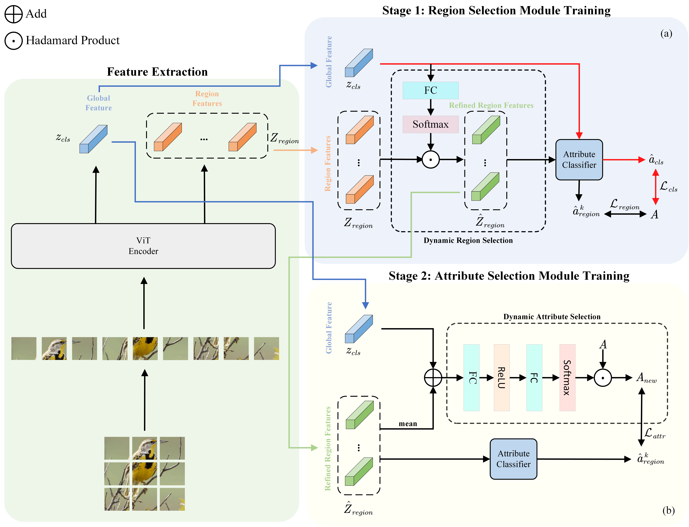

# DVGS

This repository contains the training and test code for the paper  "***Dynamic Visual-guided Selection for Zero-Shot Learning***" accepted to the Journal of Supercomputing. 

## References
Parts of our codes based on:
* [FaisalAlamri0/ViT-ZSL](https://github.com/FaisalAlamri0/ViT-ZSL)

## Contact
If you have any questions about codes, please don't hesitate to contact us by xl294487391@gmail.com.
